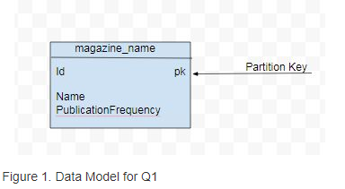
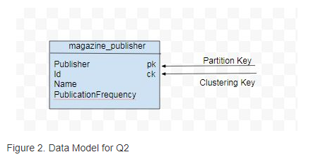

>先前我们简单介绍了cassandra的一些特性和适用场景，接下来，我们介绍下Cassandra的数据建模。

每一张表由行和列组成，cassandra将数据存储在表中。CQL被用来查询表中的数据，Cassandra的数据建模是基于查询优化的，Cassandra不支持关系型数据建模。

### 什么是数据建模

数据建模是确认实体之间关系的过程，在关系型数据库中，数据放在标准化的表中，并使用外键来引用在其他表中由关联的数据。查询引用程序在表结构和相关数的驱动下作为表关联查询。

Cassandra中，是基于查询驱动（query-driven）进行数据建模的，数据访问模式和应用程序查询确定数据的结构和组织方式来设计数据库表。

数据建模在特定的查询上，查询的最佳设计应该是只访问单表,这意味着一个查询请求的所有实体必须在同一张表中来加快数据读取的速度，数据建模最适合单个或者一组查询。是合适的查询是一张表包含1个或多个实体。在这些实体之间他们通常存在关系，并且查询应该包含这些有关系的实体，单个实体会被包含在多张表中。

### 查询驱动建模(Query-driven modeling)

不同于关系数据模型使用join来从多张表中获取数据，Cassandra不支持join，因此所有必要字段必须组合到同一张表中，因为所有的查询仅支持单表，所以数据复制到多张表是一个放规范化的过程。数据副本和高写吞吐量用来实现高性能读。

### 目标(Goals)
主键和分片键的选择对于将数据均匀分布到集群中很重要，保持一个查询从较少的分片中读取也很关键，因为不同的分片可能位于不同的节点上，并且协调者(coordinator)也需要把请求发送到每个节点上，这会带来请求开销和延迟。即使一个查询请求涉及到的不同分片在同一个节点上，较少的分片也能保证一个高效的查询。

### 分片(Partitions)

Cassandra是一个数据存储在集群节点上的分布式数据库，分片键用来区分集群节点上的数据，Cassandra采用一种类似一致性hash的方式对存储节点上的数据分片，散列技术用于map数据与给定一个键,一个哈希函数生成一个散列值(或者只是一个散列)存储在哈希表中。分片键用主键的第一个字段生成。数据通过采用分片键划分到hash表中来提供快速查找。较少的分片可以让查询请求快速返回。

比如表t，id是主键的唯一字段
```sql
CREATE TABLE t (
   id int,
   k int,
   v text,
   PRIMARY KEY (id)
);
```
主键id生成分片键将数据分配到集群中的节点上。

下面的例子是表t的两个字段组合成主键或者是组合主键
```sql
CREATE TABLE t (
   id int,
   c text,
   k int,
   v text,
   PRIMARY KEY (id,c)
);
```

表t使用组合主键的第一个字段(id)生成分片键和用第二个字段（c）作为用来在分片内部排序的集群键（clustering key），使用集群键对数据进行排序来提高检索效率。

一般来说，主键的第一个字段将生成分片键，剩余的字段作为集群键用来在分片内部排序，数据分片提高了读写的效率，其他非主键字段可以分别创建索引，来提高查询效率。

分片键也可能根据多个字段生成，如果一个主键的第一个组件是多个字段的组合，

下面的例子是表t的主键第一个组件是两个字段的组合

```sql
CREATE TABLE t (
   id1 int,
   id2 int,
   c1 text,
   c2 text
   k int,
   v text,
   PRIMARY KEY ((id1,id2),c1,c2)
);
```

表t通过主键的第一个组件（id1,id2）来生成分片键（partition key）并且其余的字段（c1,c2）生成用来分片内排序的集群键（clustering keys）

### 和关系型数据模型比较

关系型数据库通过外键（foreign keys）与其他表关联存储数据。关系型数据库的建模方式是以表为中心（table-centric）。查询必须通过表关联从多张表中获取有关联的数据。Cassandra没有外键的概念或数据的完整性。Cassandra的数据模型是基于高效查询，查询请求不应该涉及多张表。关系型数据库规范数据避免冗余，Cassandra相反，在多张表上冗余数据形成以查询为中心的数据模型（query-centric data model）。如果Cassandra数据模型不能为特性查询完全整合不同实体关系的复杂性，可以在应用程序中使用客户端（client-side）。

### 案例

一个<code>magazine</code>数据集包含杂志的一些属性，比如 magazine id, magazine name, publication frequency, publication date和 publisher，一个杂志数据的基本查询（Q1）是列出所有杂志的名称，包括出版周期，但并不是所有的属性都需要，Q1的数据模型只需要id（partition key）、magazine name, publication frequency。如下



另一个查询（Q2）通过出版社（publisher）列出所有的杂志名称（magazine names ），Q2的数据模型可能由可选属性<code>publisher</code>做分片键，
<code>id</code>用来做分片的集群键。



### 设计模式（Designing Schema）

Q1采用如下模式
```sql
CREATE TABLE magazine_name (id int PRIMARY KEY, name text, publicationFrequency text)
```

Q2的模式定义包含排序的集群键

```sql
CREATE TABLE magazine_publisher (publisher text,id int,name text, publicationFrequency text,
PRIMARY KEY (publisher, id)) WITH CLUSTERING ORDER BY (id DESC)
```
### 数据模型分析（Data Model Analysis）

数据模型是必须分析和基于存储、容量、冗余和一致性最优的概念模型，数据模型可能会被分析的结果修改。数据模型分析的考虑点和限制点如下：

* 分片大小（Partition Size）
* 数据冗余（Data Redundancy）
* 磁盘空间（Disk space）
* 轻量级事务（Lightweight Transactions (LWT)）

分片大小的两个措施是一个分片值的数目和磁盘上分片的大小。尽管这些措施的要求是基于应用程序而变化，但一般指南是保持一个分片数据的条数在100,000以下，一个分片的磁盘空间在100M以下。

数据冗余是在表中的数据副本并复制到多个分片上的数据模型设计。但是应该考虑作为一个参数保持在最低限度。轻量级事务可能会影响性能和查询使用LWT应该保持在最小。

### 写在最后
该文基于官方翻译，本人水平有限，如有不当，敬请指出。[查看原文](http://cassandra.apache.org/doc/latest/data_modeling/intro.html#introduction)