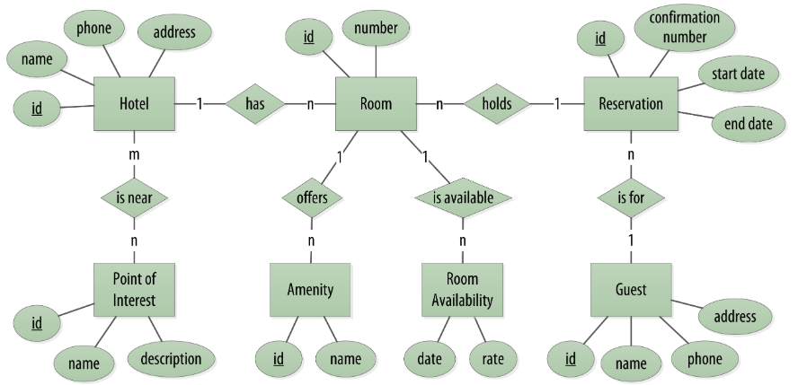

>首先我们创建一个领域模型来便于理解，然后看看在Cassandra中怎么将它从关系映射到分布式哈希表模型。

我们采用一个足够复杂的案例来展示各种各样的数据结构和设计模式，但不要陷于细节之中。领域模型我们都很熟悉，这可以让你专注于了解在Cassandra中是如何工作的，而非在应用程序域中。

例如，我们使用每个人都容易理解并且都能涉及到的域（domain）：预定酒店（making hotel reservations）。

概念域包括酒店、在酒店的客人、每个酒店房间的集合、价格和可用的房间，还包括客人的预约记录。酒店通常也维护着客人在酒店期间想参观的公园、博物馆、画廊、购物纪念碑或附近其他地方“兴趣点”（points of interest）的集合。酒店和兴趣点需要维护地理定位数据,以便他们可以在地图上找到mashup,和计算距离。

下图采用Peter Chen推广的实体关系模型（entity–relationship model）描述概念域，这是简单的图标，矩形表示领域的实体，椭圆表示这些实体的属性,属性带下划线代表是唯一标识符（unique identifiers），菱形表示实体之间的关系。关系和实体之间的连接器显示了连接的多样性。

显然，在实际场景中，会有更多的考虑点和更复杂，例如，酒店价格受到广泛因素计算的波动性。这里你定义的东西足够复杂和接触到重要的点，但要简单保持关注点来学习Cassandra。

### 写在最后

该文基于官方翻译，本人水平有限，如有不当，敬请指出。[查看原文](http://cassandra.apache.org/doc/latest/data_modeling/data_modeling_conceptual.html)