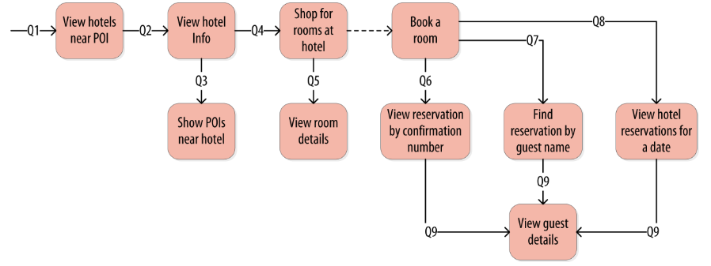

>本文主要通过一个酒店的案例来介绍设计数据模型。

我们尝试query-first方法开始为酒店应用程序设计数据模型。开始识别查询在应用程序的用户界面设计往往是一个伟大的工艺。假定你已经和项目利益相关者经过了充分的讨论，并且用户体验设计师已经设计了用户界面或框架的关键用例，你可能有以下一些查询列表：

* Q1. Find hotels near a given point of interest.
* Q2. Find information about a given hotel, such as its name and location.
* Q3. Find points of interest near a given hotel.
* Q4. Find an available room in a given date range.
* Q5. Find the rate and amenities for a room.

通常按照速记数字参照查询比全部解释查询更有用，查询列表通过Q1,Q2等标记，并在示例图中引用。

如果项目成功了，你当然希望顾客预定酒店，比如选择可用的房间，录入访客信息。显然你还需要一些地址预订的查询和顾客概念数据模型的实体。即使在这里,但是,你不仅要从客户的角度考虑如何写数据,也要考虑如何将查询数据运用在下游的用例上。

你自然倾向先设计表结构来存储预约和访客记录，和仅考虑请求他们的查询。在讨论shopping queries 之前你可能有一些类似“酒店和兴趣点的数据从何而来”的紧张压力，别担心，你很快就会看到，下面列出了一些描述用户如何访问的一些查询。

* Q6. Lookup a reservation by confirmation number.
* Q7. Lookup a reservation by hotel, date, and guest name.
* Q8. Lookup all reservations by guest name.
* Q9. View guest details.

所有在应用程序上工作流的上下文中显示的查询所示如下图。图中的一个方块代表工作流中的一个步骤，箭头表明步骤之间的流转和关联的查询。如果建模合理，工作流的一个步骤应该完成一个任务，并解锁下一个步骤。例如：“View hotels near POI”任务帮助了解几个酒店，包括唯一键，选择酒店的主键用于Q2部分来获得详情。预定房间的行为创建一条稍后可能会被客人或者酒店职员通过各种各样额外查询的预定记录。

### 写在最后

该文基于官方翻译，本人水平有限，如有不当，敬请指出。[查看原文](http://cassandra.apache.org/doc/latest/data_modeling/data_modeling_queries.html)