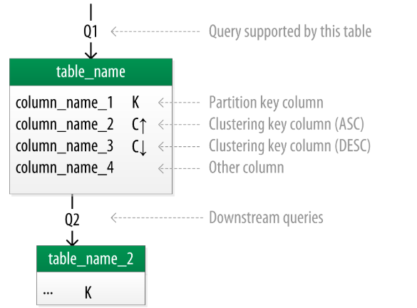
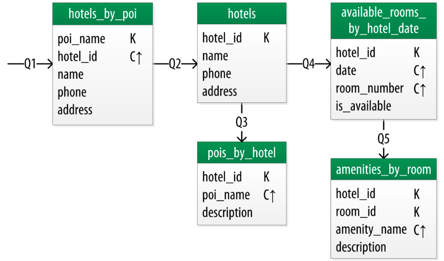
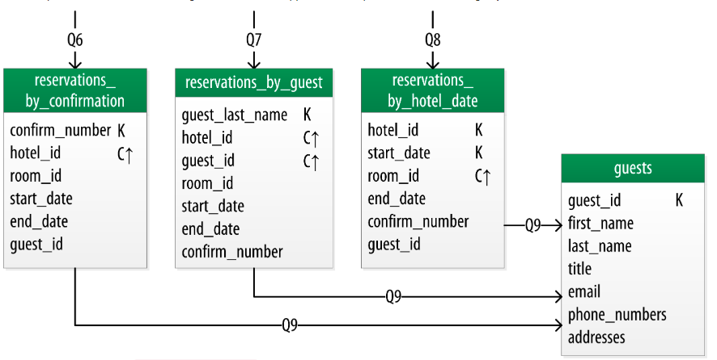

>本文主要通过一个酒店的案例来介绍逻辑数据模型设计。

现在已经定义完了查询接口，现在开始设计Cassandra的表结构吧。首先创建一个包含每一个表的逻辑模型，为每个查询、获取实体和概念关系。

识别要查询的主要实体类型和开始使用实体的名称来为每个表命名。如果要根据别的实体的属性查询，将这些信息附加到表名后边，用_by_分割，例如hotels_by_poi。

接下来定义表的主键、基于必要查询属性添加分片键列和为了保证唯一性的集群列及支持排序设计。

主键的设计是非常重要的。它将决定每个分片上存储多少数据和数据在磁盘上的组织形式，这反过来影响Cassandra的读取性能。

完成每张表添加额外的属性用于查询，如果这些额外的属性在每个分片键中都是相同的，则把该列标记成静态的。

既然一段简洁的描述一个相当复杂的过程，那么完成一个详细的案例是非常有价值的。首先我们来介绍下用来代表逻辑模型的符号。

几个人在Cassandra社区提出在图形表单上用符号捕捉数据模型，该文使用的符号是Artem Chebotko提供了在设计中查询和表之间比较简单的信息可视化方法。下面图例展示了Chebotko的逻辑数据模型符号。

每张表通过表名和列展示，主键列通过符号标识，比如K代表分片键列和C↑ or C↓ 代表集群列，连接线表示进入表或表之间的关系来表明每张表的查询已被设计支持。

### 酒店逻辑数据模型

下图展示了通过涉及到酒店、兴趣点、酒店和便利设施的查询的Chebotko逻辑数据模型。你立马能注意到Cassandra的设计不包含房间或者便利设施的专用表。这是因为该工作流没有确认一些查询需要直接访问。

我们来探索每一张表的详细信息。

第一个查询（Q1）是查找酒店附近的兴趣点。因此你需要称这个表为<code>hotels_by_poi</code>。通过一个命名点查询是兴趣点应该成为主键一部分的一个线索。我们通过名称指向兴趣点，因为用户如何根据工作流开始查询。

您会注意到,你当然可以有多个酒店附近的一个给定的兴趣点，那么你需要主键中的另外一个组件为了确保每个酒店有一个唯一的分片。这样添加hotal key到集群键中。

设计中，一个重要的考虑因素是主键确保表中唯一的数据元素。否则你可能会不小心覆盖到数据。

现在看第二个查询（Q2），你需要一张表获得指定酒店的信息，一种方法是添加所有的酒店属性到表<code>hotels_by_poi</code>,而不是只添加一些应用工作流必要的属性。

从流程图上可以看出，你知道表<code>hotels_by_poi</code>用来显示带有基本信息的酒店列表和返回酒店的唯一标识符。当选择一个查看明细的时候，这时候你能用到Q2来获得酒店的详细信息。因为你已经从Q1中得到<code>hotel_id</code>,使用他作为查询指定酒店的指向。因此第二张表叫<code>hotels</code>

另一个选项应该在<code>hotels</code>表中存储<code>poi_names</code>集合，这是一个同样有效的方法。您将学习通过哪种方法是应用程序最好的选择。

Q3是Q1的反转，查询酒店附近的兴趣点，而不是查询酒店附近的兴趣点。这次无论如何，你要访问每个兴趣点的明细，表<code>pois_by_hotel</code>是个典型代表。之前，添加兴趣点名称作为集群键保证唯一性。

这时候，我们来考虑如何支持Q4帮助用户查询已选择晚上感兴趣酒店的可用房间，注意查询包含开始日期和结束日期。因为基于范围查询，而不是单个日期，你知道你需要使用日期作为集群键。使用<code>hotel_id</code>作为主键在单个分片上对每个酒店房间的数据进行分组来帮助搜索更快。我们叫他<code>available_rooms_by_hotel_date</code>表。

为了支持范围查询。在范围查询中，使用集群列存储需要访问的属性。注意集群列的顺序非常重要。

表<code>available_rooms_by_hotel_date</code>的设计是<b>wide partition</b>模式的一个实例，在讨论数据库支持相似模型的时候有时候也被称为<b>wide row</b>，但是从Cassandra观点来看wide partition是一个准确的描述。模式的本质是在一个分区中分組多个有关联的行，这是为了支持在单个查询中快速访问一个分区中的多行。

为了完成购物的部分数据模型，添加表<code>amenities_by_room</code>来支持Q5，这允许用户查看提供所需入住房间的便利设施。

### 预定数据模型

现在我们来看预定查询请求。数字展示预定的逻辑数据模型。注意这些表表示非规范化设计。相同的数据存在多张表中，但是他们的key不一样。

为满足Q6，表<code>reservations_by_guest</code>用来根据客人名称查询预定记录。你可以想象查询Q7代表客人使用自助网站或一个呼叫中心代理试图寻求帮助。因为客人名称不唯一，在集群列中也要包含客人id。

Q8和Q9特别帮助提醒你创建查询来支持应用的利益相关者而不仅仅是客户,员工,甚至分析团队,供应商,等等。

酒店员工可能希望按日期看到即将到来的预定记录为了了解酒店是如何执行的，比如那些时间酒店已出售或者被低价出售。Q8支持根据日期检索酒店的预定记录。

最后，创建<code>guests</code>表，他提供了用户存储客人信息的位置。既然这样，你指定一个分隔唯一标识符，相同名称的客人并不少见。在一些组织架构中，客户数据库,如<code>guests</code>表将是一个单独的客户管理应用程序的一部分,这就是为什么其他客人访问模式是省略的例子。

### 模式和反模式

与其他类型的软件设计，在Cassandra中有一些著名的模式和反模式的数据建模。你已经使用了常见模式中的一种-<code>wide partition</code>。

**time series**是<code>wide partition</code>的扩展。在这个模式中，一系列以特定的时间间隔测量序列存储在一个分区，并且测量时间用来作为主键部分。这种模式广泛的用在商业分析、传感数据管理和科学实验上。

<code>time series</code>除了测量数据也很有用，考虑银行应用案例。在一行存储每位用户的余额，但这可能会导致大量的读写争用各种客户检查其余额或事务。你可能在写余额操作中开启事务来保证更新余额不会出错。相比之下,time series-style设计将存储每个事务作为时间戳行和离开计算当前余额的工作给应用程序。

一个设计陷阱是许多新用户落入试图将Cassandra作为一个队列。队列中的每项在一个宽分区中带有时间戳存储。每项追加到队列的末尾并且从列头读取，读取之后从队列中删除。这个设计非常吸引人，特别是时间序列模式的明显的相似之处。这种方式的问题是删除项Cassandra必须扫描之前为了从队列的前面读取数据。越来越多的tombstones开始降低读性能。

队列反模式提醒人们,任何设计依赖于数据的删除是一个潜在的性能不佳的设计

### 写在最后

该文基于官方翻译，本人水平有限，如有不当，敬请指出。[查看原文](https://cassandra.apache.org/doc/latest/data_modeling/data_modeling_logical.html)