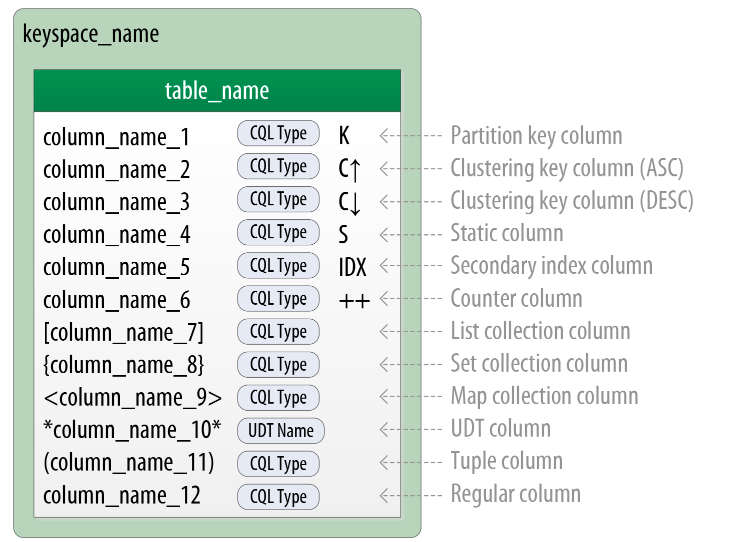
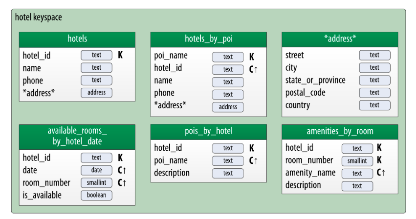
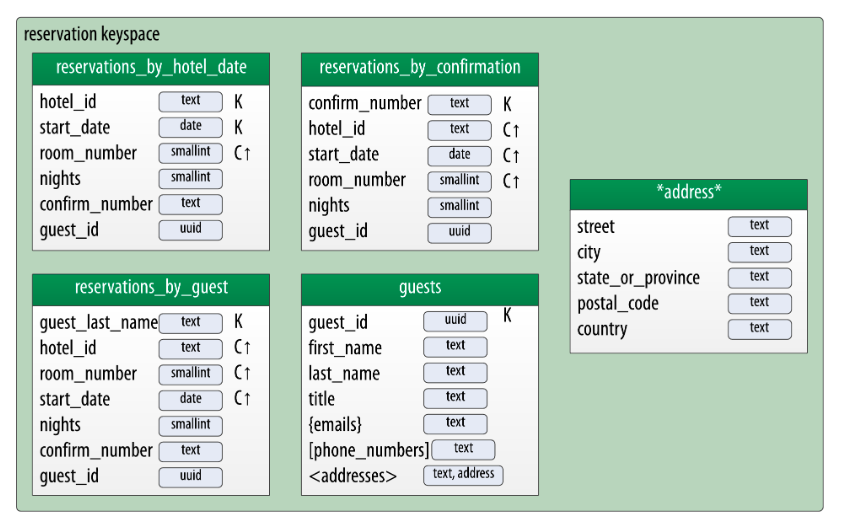

>一旦逻辑数据定义好，那么创建物理模型就非常简单了。

通过每个逻辑模型表，为每项定义类型。你可以使用一些有效的<code>CQL data type</code>，包括基本类型、集合和用户自定义类型。确认添加的额外用户自定义类型能够让你的设计保持简单。

分配数据类型之后，你应该通过尺寸计算分析模型和测试模型是如何工作的。你会基于发现做出一些调整，再一次让我们通过一个例子更详细地讨论数据建模过程工作。

开始之前，我们来看一些关系Chebotko notation 物理数据模型的附加物。为了绘制物理模型，需要为每列添加类型信息。下图通过一个案例表展示了每列添加的类型。

图示包括一个包含每张表的键空间的指向，列使用集合来表示视觉线索和用户定义的类型。注意静态列指定和二级索引列。分配这些到逻辑模型的一部分没有限制,但是通常更多的是物理数据建模问题。

### 酒店物理数据模型

现在我们来开始物理数据模型的工作。首先需要键空间包含表，为了保持设计相对简单，创建键空间<code>hotel</code>包含酒店相关的表和可用数据，创建键空间<code>reservation</code>包含预定相关的表和客人信息。在实际系统中，需要用更多的键空间划分表来分离关注点。

比如表<code>hotels</code>，使用Cassandra的<code>text</code>来代表hotel的<code>id</code>。比如地址，创建<code>address</code>用户自定义类型。不同国家之间的数字格式化差异性比较大，因此使用<code>text</code>类型表示手机号码。

采用<code>uuid</code>类型表示属性是非常有意义的，比如<code>hotel_id</code>，本文档使用主要<code>text</code>属性作为标识符来保持案例尽量简单和可读。比如酒店行业的常用惯例是通过比如“AZ123”或者“NY229”的短码代指属性。该例在确认没必要保证全局唯一情况下，使用<code>hotel_ids</code>这些值。

唯一id指向唯一元素是很有帮助的，在表中使用<code>uuids</code>作为指向代表其他实体。这能最小化实体之间的耦合。在微服务架构中这是非常有用的，他通过分割服务来管理每种实体类型。

采用相同的方法，开展基于逻辑酒店数据模型创建物理上的各种各样的表的工作。设计结果如图：

注意设计中也包括<code>address</code>类型。设计的*表示用户自定义类型，并且没有定义主键列。这个类型用在<code>hotels</code>和<code>hotels_by_poi</code>表中。

用户自定义类型通常用来帮助减少重复的非主键列，就像<code>address</code>类型，他能在设计上减少重复。

记住UDT的范围是定义的键空间，键空间<code>address</code>和<code>reservation</code>在设计之下，这仅仅是在数据模型设计中众多权衡中做出的一个。

### 预定物理数据模型

检查预定表，记住逻辑模型包括三张非规范化的表支持通过确定数量、客人、酒店和日期的预定查询。物理数据模型设计的第一个迭代是假设开始手动管理这些反规范化。注意这个可以使用Cassandra的物化视图进行改进。

现在<code>address</code>类型再现这个键空间和在所有表中<code>guest_id</code>建模为<code>uuid</code>类型。

### 写在最后

该文基于官方翻译，本人水平有限，如有不当，敬请指出。[查看原文](https://cassandra.apache.org/doc/latest/data_modeling/data_modeling_physical.html)